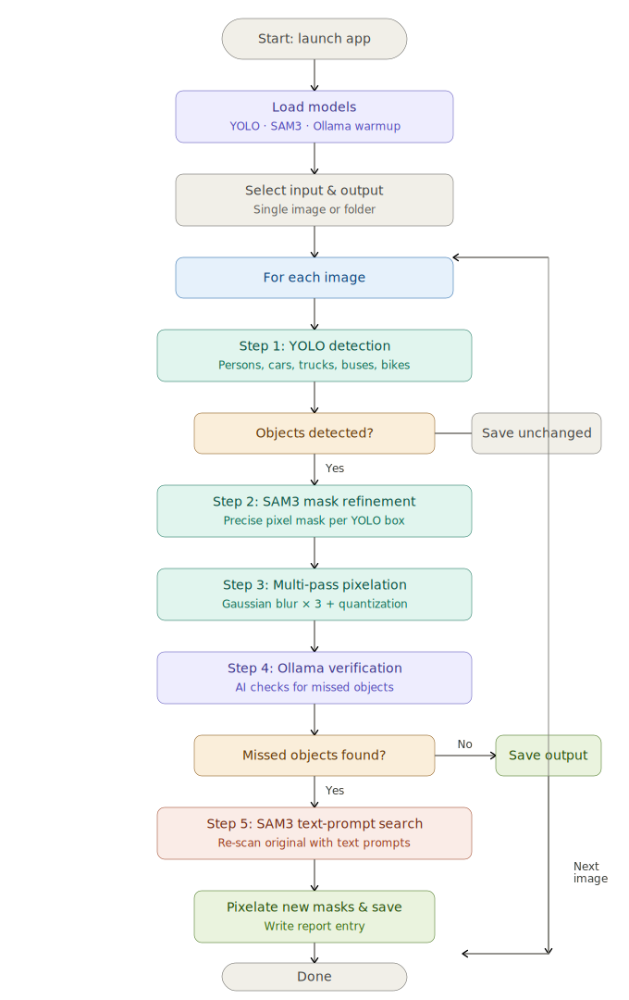

# NeuralCensor

An AI-powered tool for fully automatic, pixel-precise image anonymization. NeuralCensor combines three state-of-the-art models into a single pipeline:

1. **YOLOv8** — blazing-fast object detection for persons & vehicles  
2. **SAM 3 (Segment Anything 3)** — pixel-perfect contour masks  
3. **Ollama Vision LLM** — paranoid verification with automatic SAM 3 re-segmentation  

Every step runs **100% locally** on your machine. No images are ever uploaded to any cloud.

---

## Key Features

- **Privacy First** — All processing happens on-device. Your images never leave your machine.
- **Comprehensive Detection** — YOLOv8 detects persons, cars, trucks, buses, motorcycles, and bicycles — even in dense crowds or far backgrounds.
- **Pixel-Perfect Masking** — SAM 3 replaces crude bounding-box blurs with exact contour masks that follow each object's outline.
- **Multi-Pass Gaussian Blur** — 3× Gaussian blur + pixel quantization makes reconstruction practically impossible.
- **SAM 3 Safety Pass** — Before Ollama verification, SAM 3 runs a second text-prompt scan on the original image to catch anything YOLO missed. Only genuinely new regions are added.
- **Strict LLM Verification** — After pixelation and the SAM 3 safety pass, a local Vision LLM (e.g. Gemma 4) reviews the result. It is instructed to be *paranoid*: even a single visible head, arm, or silhouette counts as a missed person.
- **SAM 3 Third Pass** — If the LLM still finds missed objects, SAM 3 runs one final text-prompt search on the original image for a true correction layer.
- **Batch Processing** — Process single images, flat folders, or nested folder structures via a modern dark-themed GUI.
- **Fully Automated Setup** — `start.bat` installs everything on first run: Python venv, PyTorch + CUDA, YOLO, SAM 3, and the SAM 3 checkpoint. **No manual steps required.**
- **Automatic Ollama Management** — `start.bat` checks whether Ollama is installed and whether the required vision model is already downloaded. If the model pull fails due to an outdated Ollama version, it **automatically downloads and installs the latest Ollama**, then retries the model download — all without any user interaction.

---

## How the Pipeline Works

<p align="center">
  
</p>

### Why SAM 3 instead of YOLO for the second pass?

Re-running YOLO after Ollama verification would return the **exact same detections** as before. Instead, SAM 3 uses text prompts ("person", "car", "truck", etc.) to scan the **original unblurred image** for objects that YOLO missed. This happens twice: once automatically before Ollama as a safety net, and once more if Ollama flags remaining issues.

---

## Prerequisites

| Requirement | Details |
|---|---|
| **NVIDIA GPU** | Required — minimum **12 GB VRAM** (SAM 3 ~5 GB + Ollama vision model ~7 GB), tested on 24 GB |
| **Python 3.12+** | Recommended for SAM 3 compatibility |
| **Ollama** | Must be installed and running. `start.bat` handles installation and model download automatically. |
| **Git** | Required for SAM 3 installation from GitHub |
| **HuggingFace Account** | Required for downloading the SAM 3 checkpoint (free, gated access) |

> **⚠️ GPU Requirement:** NeuralCensor loads SAM 3 (~5 GB VRAM) and an Ollama vision model (e.g. `gemma4:e4b` ~7 GB VRAM) simultaneously. A GPU with **at least 12 GB VRAM** is required. GPUs with less VRAM will cause out-of-memory errors or fall back to CPU, which is extremely slow. **Tested on NVIDIA RTX with 24 GB VRAM.**

---

## Installation & Quick Start

NeuralCensor handles the entire setup automatically via `start.bat`.

1. Clone or download this repository.
2. Ensure you have sufficient disk space (~10 GB for PyTorch, SAM 3, and model checkpoints).
3. **Double-click `start.bat`**.

### What `start.bat` does on first run:

1. Creates an isolated Python virtual environment (`venv`)
2. Installs PyTorch 2.10 with CUDA 12.8
3. Installs all dependencies from `requirements.txt`
4. Installs SAM 3 from the official GitHub repository
5. Prompts for your HuggingFace token and downloads the SAM 3 checkpoint (~5 GB)
6. Checks Ollama and the vision model:
   - If Ollama is not installed → shows download link
   - If the model pull fails (e.g. Ollama too old) → **automatically downloads and installs the latest Ollama silently**, then retries
   - If the model is missing → **automatically pulls `gemma4:e4b`** (~7 GB)
7. Launches the NeuralCensor GUI

> **No manual action is required at any step.** Simply double-click `start.bat` and wait.

> On subsequent runs, `start.bat` skips installation and launches the GUI directly.

---

## Usage

1. Run `start.bat` (or activate the venv and run `python neuralcensor.py`).
2. Select the **Verification Model** in the settings panel (e.g. `gemma4:e4b`).
3. Click **📂 Browse Input** and select a folder — the mode is detected automatically:
   - Folder with images directly → flat mode
   - Folder with subfolders containing images → subfolder mode (each subfolder gets its own output)
   - Mixed → both handled automatically
4. *(Optional)* Select an output folder. If left blank, a `NeuralCensor_Blurry` folder is created automatically next to the input.
5. Click **▶ Start Processing**.
6. Monitor the real-time log:
   - `YOLO Detection` → `SAM 3 Mask Refinement` → `Pixelation` → `SAM 3 Safety Pass` → `Ollama Verification` → *(if needed)* `SAM 3 3rd Pass`

An `Anonymization_Report.txt` is generated in the output folder documenting each image's processing status.

---

## YOLO Detection Classes

| Class ID | Label |
|---|---|
| 0 | Person |
| 2 | Car |
| 3 | Motorcycle |
| 5 | Bus |
| 7 | Truck |

---

## Configuration

Key constants can be adjusted at the top of `neuralcensor.py`:

| Constant | Default | Description |
|---|---|---|
| `YOLO_CONF` | 0.15 | YOLO confidence threshold (lower = more detections) |
| `SAM3_CONFIDENCE` | 0.15 | SAM 3 mask confidence threshold |
| `BLUR_KERNEL_BASE` | 101 | Gaussian blur kernel size (must be odd) |
| `BLUR_PASSES` | 3 | Number of blur passes per mask |
| `QUANTIZE_STEP` | 8 | Pixel quantization step (anti-reconstruction) |
| `PADDING_FRACTION` | 0.04 | Mask edge padding (contour dilation) |
| `OLLAMA_MAX_SIZE` | 1536 | Max image edge length sent to Ollama |

---

## Open Source & Licensing

NeuralCensor is open-source. The underlying AI models and libraries carry their own licenses:

| Component | License |
|---|---|
| **YOLOv8 (Ultralytics)** | AGPL-3.0 — public distribution requires open-sourcing modifications |
| **SAM 3 (Meta)** | Apache 2.0 |
| **Ollama** | MIT |
| **Gemma 4 (Google)** | Gemma License — allows commercial use with specific redistribution terms |
| **OpenCV** | Apache 2.0 |
| **PyTorch** | BSD-3-Clause |

---

## Project Structure

```
NeuralCensor/
├── neuralcensor.py      # Main application (GUI + processing pipeline)
├── start.bat            # Automated setup & launch script
├── requirements.txt     # Python dependencies
├── README.md
├── LICENSE
├── yolov8n.pt           # YOLOv8 nano model (auto-downloaded)
└── checkpoints/
    └── sam3/             # SAM 3 model checkpoint (downloaded via HuggingFace)
```
